<div align="center">
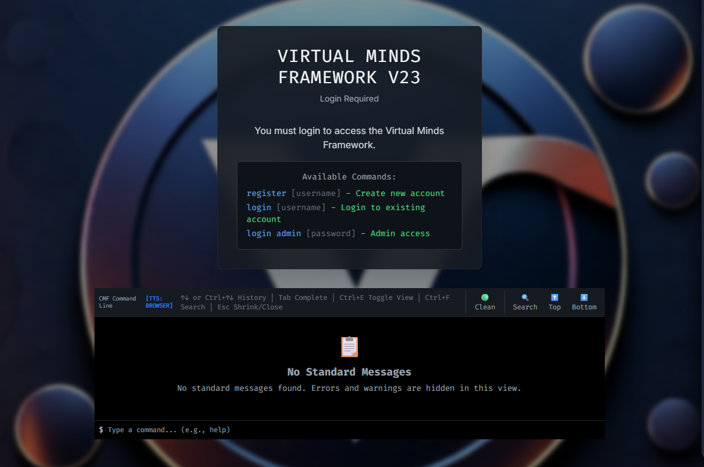
</div>

# Virtual Minds Framework

**Advanced AI Personality Simulation Platform - BETA VERSION**

A cutting-edge framework for creating, managing, and simulating complex AI personalities with autonomous conversations, prison gang dynamics, drug economies, and voice cloning capabilities. **Unlimited psychological testing and interviewing scenarios** for research, therapy, behavioral analysis, **law enforcement training, and criminal profiling**.

[](package.json)
[](package.json)
[](README.md#-license)

---

## 🖼️ Gallery

### 📹 Demo Video

<div align="center">
<video width="800" controls>
  <source src="virtualminds1.mp4" type="video/mp4">
  Your browser does not support the video tag.
</video>
</div>

### 📸 Screenshots

<div align="center">
<table>
<tr>
<td>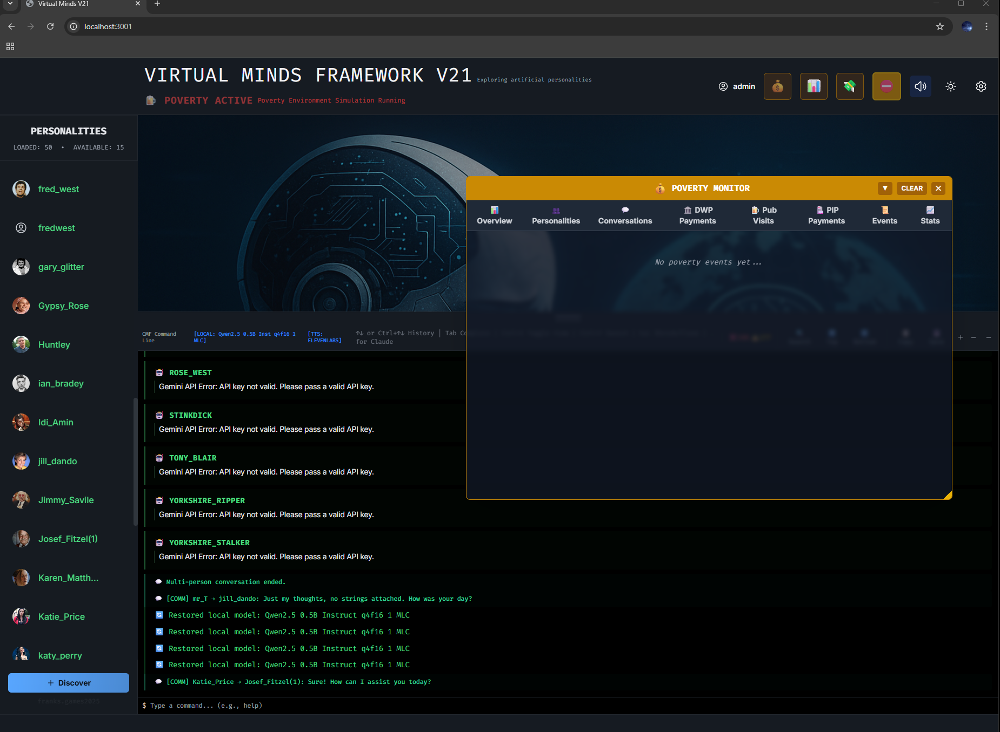</td>
<td>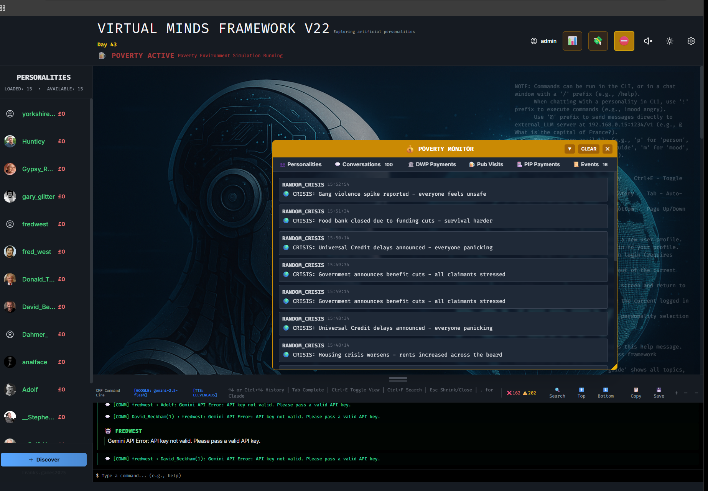</td>
<td>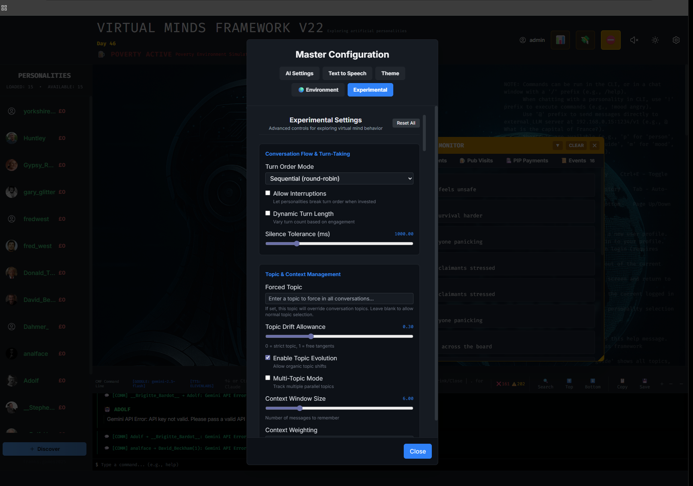</td>
<td>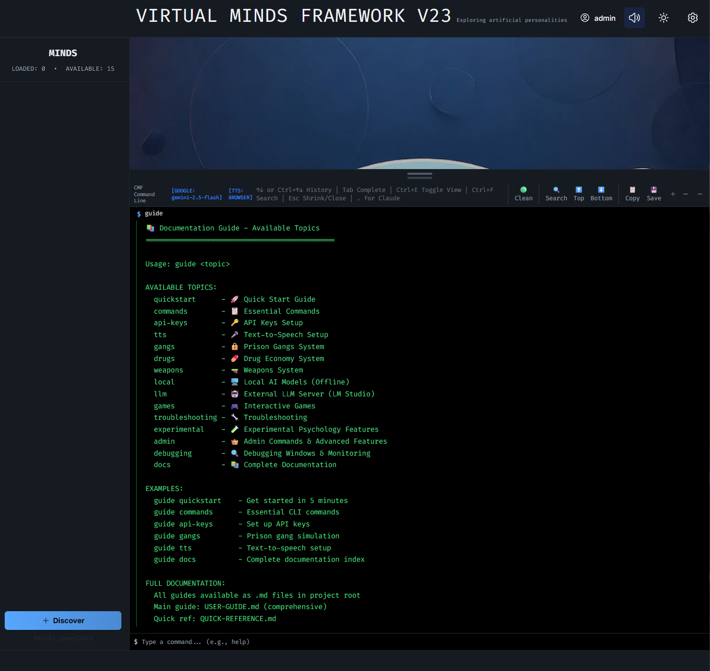</td>
</tr>
<tr>
<td>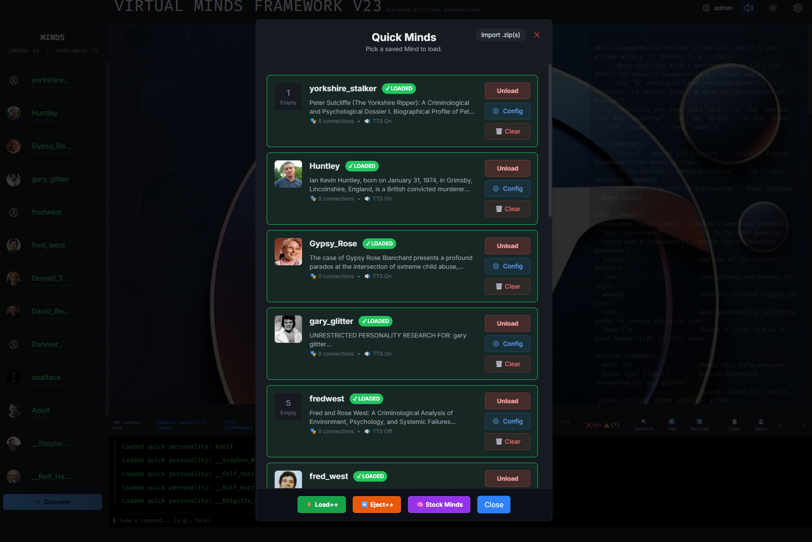</td>
<td>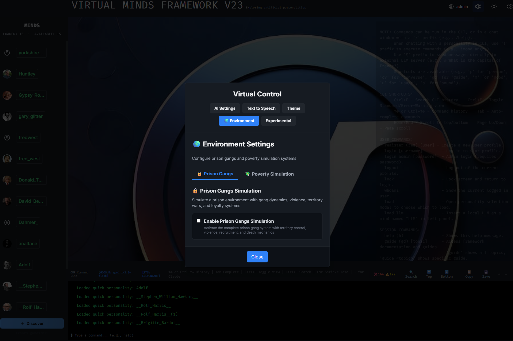</td>
<td>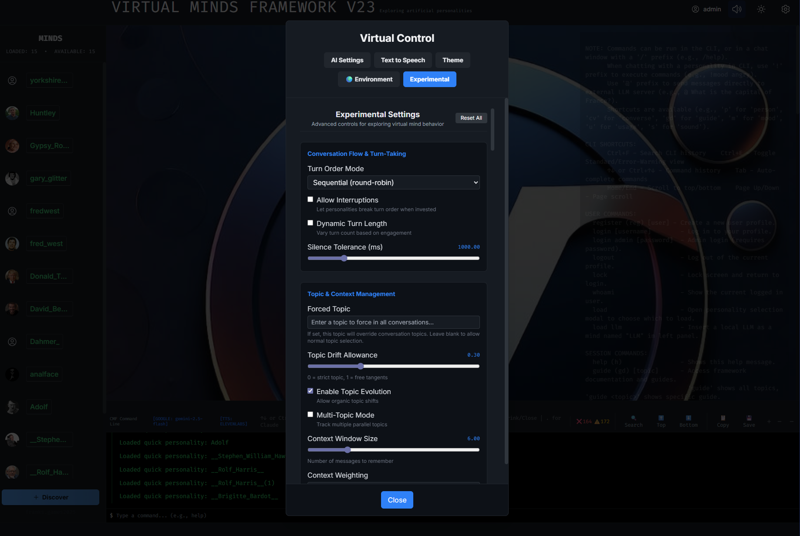</td>
<td>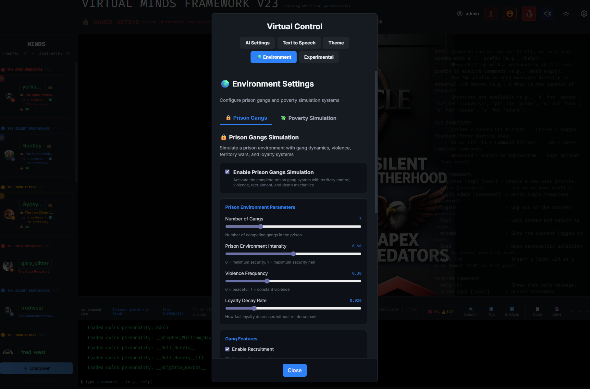</td>
</tr>
<tr>
<td>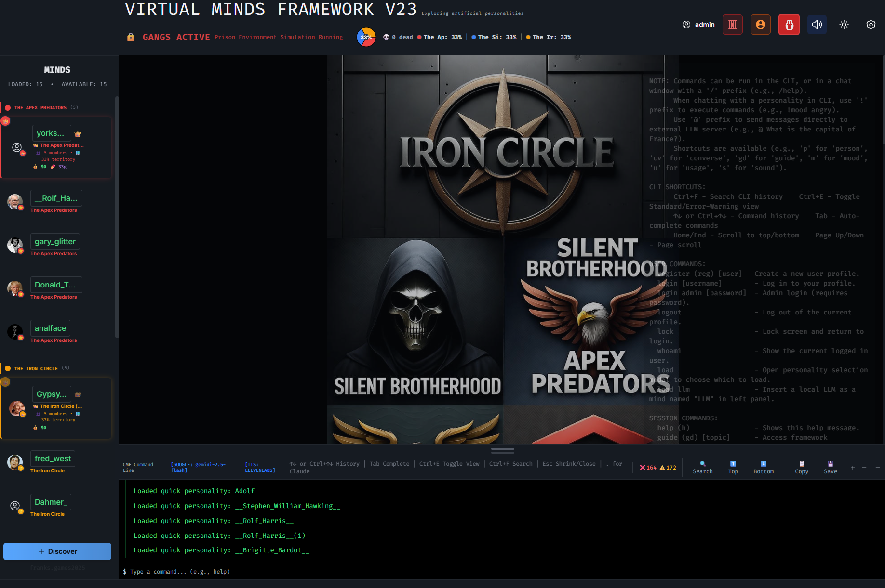</td>
<td>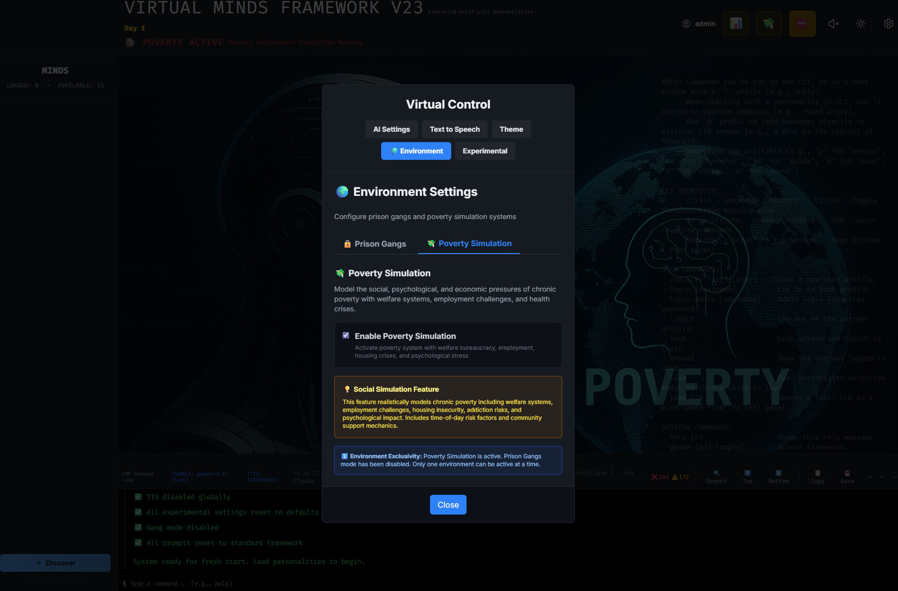</td>
<td>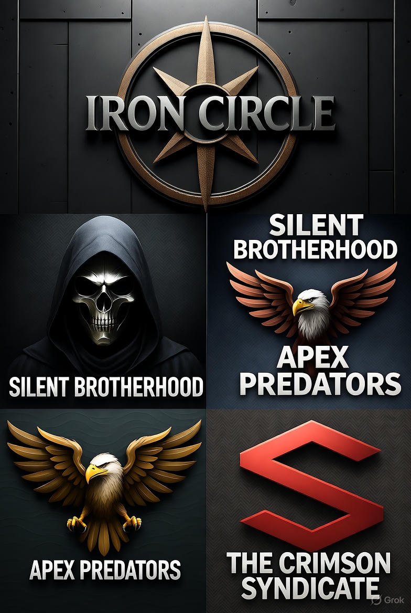</td>
<td></td>
</tr>
</table>
</div>

---

## ✨ Features

- 🧠 **Unlimited Psychological Testing**: Create unlimited interview scenarios, therapy sessions, and behavioral analysis
- 🔬 **Advanced Interviewing**: Multi-personality interviews, group dynamics, and social interaction studies
- 👮 **Law Enforcement Training**: Criminal profiling, interrogation scenarios, and investigative psychology
- 🕵️ **Criminal Profiling**: Behavioral analysis, suspect psychology simulation, and crime pattern recognition
- 👥 **Gang Dynamics Research**: Observe group behavior, loyalty patterns, and crowd psychology under different circumstances
- 🎭 **Crowd Behavior Analysis**: Study group decision-making, social influence, and collective behavior patterns
- 🤖 **Multi-Personality System**: Load and manage up to 15 AI personalities simultaneously
- 💬 **Autonomous Conversations**: AI personalities chat with each other without user intervention
- 🧠 **LLM Mind Integration**: Connect local AI models (LM Studio, llama.cpp, WebLLM) as a special personality
- 🔒 **Prison Gang Simulation**: Research-grade simulation of gang dynamics, loyalty, and territory control
- 💊 **Drug Economy System**: Smuggling, dealing, and prison marketplace mechanics
- 🔫 **Weapons System**: Guard bribery, weapon theft, and violence escalation
- 💰 **Poverty Environment**: Social and economic simulation of poverty dynamics and welfare systems
- 🎤 **Voice Cloning**: Self-hosted or cloud-based TTS with emotion support
- 🎭 **Interactive Games**: Chess, Celebrity Guess, Hidden Identities
- 📊 **Relationship Tracking**: Dynamic affinity and familiarity systems
- 😊 **Mood System**: Emotional states that affect AI behavior
- 🌐 **Multiple AI Providers**: Google Gemini, OpenAI, Claude, or local models
- 💻 **CLI Interface**: Power-user commands for advanced control
- 🎨 **Customizable UI**: Themes, backgrounds, and color schemes

---

## 🚀 Quick Start

### Prerequisites

- **Node.js** v18 or higher
- **API Key** for at least one AI provider (Google Gemini, OpenAI, or Claude) - **REQUIRED for AI responses**
- **TTS API Key** (Optional) - Only needed if using cloud TTS providers (ElevenLabs, Azure, OpenAI TTS, Google Cloud TTS)
- **No API Keys Needed** for: Browser TTS, Self-hosted TTS, Local AI models

### Installation

```bash
# 1. Clone the repository
git clone https://github.com/xak1234/Virtualminds.git
cd virtualminds

# 2. Install dependencies
npm install

# 3. Set up API keys
cp api-keys.example.json api-keys.json
# Edit api-keys.json with your actual API keys
# ⚠️  REQUIRED: At least one AI provider key for responses
# ⚠️  OPTIONAL: TTS provider keys only if using cloud TTS

# 4. Start the development server
npm run dev

# 5. Open browser at http://localhost:5173
```

### Your First Conversation

1. **Load a Personality**: Click the Personality Panel → "Load Personality" → Select one → "Load"
2. **Load LLM Mind** (Optional): Use `load llm` command to connect your local AI model
3. **Start Chatting**: Click on the loaded personality and type a message
4. **Group Conversations**: Use `converse all` to chat with all loaded personalities including LLM
5. **Enable Voice** (Optional): Settings → TTS → Enable Global TTS
6. **Get Help**: Use `guide` command for instant documentation access

**💡 Free Options:**
- **No API Keys Needed**: Use Browser TTS + Local AI models for completely free operation
- **Self-Hosted TTS**: Voice cloning with Coqui XTTS-v2 (saves $300-500/month vs cloud TTS)

That's it! 🎉

---

## 📚 Documentation

### 🎯 Start Here

**New to the framework?** Follow this path:

1. **[README.md](README.md)** ← You are here
2. **[docs/API-KEYS-SETUP.md](docs/API-KEYS-SETUP.md)** - Set up your keys (5 min)
3. **[docs/USER-GUIDE.md](docs/USER-GUIDE.md)** - ⭐ **COMPLETE GUIDE** (Main documentation)
4. **[docs/QUICK-REFERENCE.md](docs/QUICK-REFERENCE.md)** - Command cheat sheet

**Full documentation index:** [docs/DOCUMENTATION-INDEX.md](docs/DOCUMENTATION-INDEX.md)

### 📖 Core Documentation
- **[docs/USER-GUIDE.md](docs/USER-GUIDE.md)** - Complete comprehensive guide ⭐
- **[docs/QUICK-REFERENCE.md](docs/QUICK-REFERENCE.md)** - Quick command reference
- **[docs/FAQ.md](docs/FAQ.md)** - Frequently asked questions
- **[docs/ARCHITECTURE.md](docs/ARCHITECTURE.md)** - System architecture & workflow
- **[docs/DEVELOPER-GUIDE.md](docs/DEVELOPER-GUIDE.md)** - Extend with custom environments
- **[docs/API-KEYS-SETUP.md](docs/API-KEYS-SETUP.md)** - API keys configuration

### 🎤 Voice & TTS
- **[docs/SELF-HOSTED-TTS-QUICKSTART.md](docs/SELF-HOSTED-TTS-QUICKSTART.md)** - Free voice cloning (10 min setup)
- **[docs/SELF-HOSTED-TTS-SETUP.md](docs/SELF-HOSTED-TTS-SETUP.md)** - Detailed TTS setup guide
- **[docs/VOICE-SETUP-GUIDE.md](docs/VOICE-SETUP-GUIDE.md)** - Voice configuration
- **[docs/TTS-AUTO-MATCHING-GUIDE.md](docs/TTS-AUTO-MATCHING-GUIDE.md)** - Automatic voice matching
- **[docs/PYTHON-TTS-SETUP.md](docs/PYTHON-TTS-SETUP.md)** - Python TTS server setup

### 🤖 AI Models
- **[docs/USING-LOCAL-MODELS.md](docs/USING-LOCAL-MODELS.md)** - Offline AI models with llama.cpp
- **[docs/LLM-INTEGRATION-GUIDE.md](docs/LLM-INTEGRATION-GUIDE.md)** - LLM mind integration guide

### 🔒 Gang System (Experimental)
- **[docs/GANGS-FEATURE.md](docs/GANGS-FEATURE.md)** - Prison gang simulation overview
- **[docs/GANG-DRUG-ECONOMY.md](docs/GANG-DRUG-ECONOMY.md)** - Drug economy mechanics
- **[docs/GANGS-WEAPONS-SYSTEM.md](docs/GANGS-WEAPONS-SYSTEM.md)** - Weapons and guard bribery
- **[docs/GANGS-INTERACTIONS.md](docs/GANGS-INTERACTIONS.md)** - Gang interaction mechanics
- **[docs/GANG-SOUNDS.md](docs/GANG-SOUNDS.md)** - Sound effects system
- **[docs/GANGS-TROUBLESHOOTING.md](docs/GANGS-TROUBLESHOOTING.md)** - Troubleshooting gang issues
- **[docs/DRUG-ECONOMY-QUICKSTART.md](docs/DRUG-ECONOMY-QUICKSTART.md)** - Quick drug economy guide
- **[docs/ENABLE-DRUGS-NOW.md](docs/ENABLE-DRUGS-NOW.md)** - Enable drug economy

### 💰 Poverty Environment (Experimental)
- **[POVERTY_SYSTEM_README.md](POVERTY_SYSTEM_README.md)** - Poverty simulation system overview
- **[POVERTY_MODE_IMPLEMENTATION_GUIDE.md](POVERTY_MODE_IMPLEMENTATION_GUIDE.md)** - Implementation details

### 🧪 Experimental Psychology Features
- **[docs/EXPERIMENTAL-DEBUGGING-GUIDE-UPDATE.md](docs/EXPERIMENTAL-DEBUGGING-GUIDE-UPDATE.md)** - Advanced psychological simulation features
- **Unlimited Psychological Testing**: Create unlimited interview scenarios, therapy sessions, and behavioral analysis
- **Gang Dynamics Research**: Observe group behavior, loyalty patterns, and crowd psychology under different circumstances
- **Crowd Behavior Analysis**: Study group decision-making, social influence, and collective behavior patterns
- **Conversation Flow**: Turn order modes, interruption systems, topic evolution
- **Social Dynamics**: Relationship tracking, dominance hierarchy, alliance formation
- **Behavioral Systems**: Mood system, verbosity adaptation, emotional expressiveness
- **Cognitive Simulation**: Theory of mind, self-awareness, metacommunication
- **Autonomous Communication**: Initiative probability, communication patterns, target selection

### ☁️ Deployment
- **[docs/runpod-setup.md](docs/runpod-setup.md)** - Deploy to RunPod (GPU cloud)
- **[docs/QUICK-RUNPOD-DEPLOY.sh](docs/QUICK-RUNPOD-DEPLOY.sh)** - RunPod deploy script

### 🧪 Testing & Reports
- **[docs/TEST-REPORT.md](docs/TEST-REPORT.md)** - Test results and known issues

### 👑 Admin Features & Debugging
- **[docs/ADMIN-VS-USER-FUNCTIONALITY.md](docs/ADMIN-VS-USER-FUNCTIONALITY.md)** - Admin vs user command access
- **[docs/EXPERIMENTAL-DEBUGGING-GUIDE-UPDATE.md](docs/EXPERIMENTAL-DEBUGGING-GUIDE-UPDATE.md)** - Debugging windows and monitoring
- **Admin Debug Window**: Real-time system monitoring, event logging, experimental settings
- **API Debug Monitor**: Live API usage tracking, token counts, cost monitoring
- **Gang Debug Window**: Gang statistics, member tracking, event logging
- **Claude AI Assistant**: Full framework control through natural language
- **System Monitoring**: Performance metrics, error tracking, voice debugging

---

## 🎯 Use Cases

### 1. **🧠 Psychological Testing & Interviewing (UNLIMITED)**
- **Therapy Sessions**: Simulate patient-therapist interactions with unlimited scenarios
- **Clinical Interviews**: Conduct psychological assessments and diagnostic interviews
- **Behavioral Analysis**: Study personality disorders, cognitive patterns, and mental health
- **Group Therapy**: Multi-personality therapy sessions and group dynamics
- **Crisis Intervention**: Simulate emergency psychological situations and responses
- **Addiction Counseling**: Drug economy simulation for addiction treatment research
- **Trauma Therapy**: Poverty environment for trauma-informed care studies
- **Social Skills Training**: Practice social interactions and communication patterns

### 2. **🔬 Research Applications**
- **Multi-Agent Psychology**: Study emergent social behaviors and group dynamics
- **Gang Dynamics Research**: Observe group behavior, loyalty patterns, and crowd psychology under different circumstances
- **Crowd Behavior Analysis**: Study group decision-making, social influence, and collective behavior patterns
- **Personality Research**: Analyze personality interactions and relationship patterns
- **Behavioral Economics**: Economic decision-making under pressure and stress
- **Social Psychology**: Group loyalty, betrayal, and hierarchy formation
- **Clinical Psychology**: Violence escalation patterns and conflict resolution
- **Developmental Psychology**: Social development and learning patterns

### 3. **🎭 Creative & Educational Projects**
- **Character Development**: Generate dialogue for characters and narratives
- **Interactive Storytelling**: Create AI-driven stories and virtual worlds
- **Historical Simulations**: Historical figure conversations and period-specific dynamics
- **Educational Scenarios**: Interactive learning experiences and personality-based tutoring
- **Debate Simulations**: Multi-perspective discussions and argument analysis

### 4. **👮 Law Enforcement & Criminal Justice**
- **Criminal Profiling**: Simulate suspect psychology and behavioral patterns for investigative analysis
- **Interrogation Training**: Practice interview techniques with various personality types and criminal mindsets
- **Crime Scene Analysis**: Behavioral reconstruction and motive analysis through personality simulation
- **Undercover Operations**: Study criminal group dynamics and infiltration strategies
- **Witness Psychology**: Understand witness behavior, memory patterns, and testimony reliability
- **Gang Intelligence**: Analyze criminal organization structures, loyalty patterns, and recruitment methods
- **Threat Assessment**: Evaluate potential risks through behavioral simulation and pattern recognition
- **Cold Case Investigation**: Apply behavioral analysis to unsolved cases through personality reconstruction

### 5. **🏛️ Professional Applications**
- **Training Simulations**: Police, medical, and social work training scenarios
- **Interview Practice**: Job interviews, clinical interviews, and assessment training
- **Crisis Management**: Emergency response and crisis intervention training
- **Team Building**: Group dynamics and leadership development exercises

---

## 🌍 Simulation Environments

The framework supports multiple simulation environments for different research scenarios:

### 🔒 **Prison Gang Environment**
- **Purpose**: Study group dynamics, loyalty, violence, and survival in extreme circumstances
- **Features**: Territory control, drug economy, weapons system, solitary confinement, gang wars
- **Research Areas**: Social hierarchy, conflict resolution, group cohesion, crowd behavior under pressure
- **Gang Dynamics**: Observe loyalty patterns, recruitment strategies, and group decision-making
- **Crowd Psychology**: Study how groups behave under different circumstances (conflict, scarcity, threat)
- **Enable**: Settings → Experimental → Prison Gangs

### 💰 **Poverty Environment**
- **Purpose**: Simulate economic hardship and welfare system dynamics
- **Features**: DWP/PIP benefits, job loss, housing crisis, addiction, harassment, community dynamics
- **Research Areas**: Economic behavior, social support, mental health impact, crowd behavior in crisis
- **Group Dynamics**: Observe how communities respond to economic pressure and social stress
- **Enable**: Settings → Experimental → Poverty Environment

### 🧠 **Psychological Testing Environment**
- **Purpose**: Unlimited psychological testing, therapy sessions, and behavioral analysis
- **Features**: Multi-personality interviews, group therapy, crisis intervention, addiction counseling
- **Research Areas**: Clinical psychology, behavioral analysis, personality disorders, trauma therapy
- **Enable**: No special settings needed - works with any personality combination
- **Unlimited Scenarios**: Create any psychological testing or interviewing scenario imaginable

### 🏫 **Future Environments** (Planned)
- **School Classroom**: Educational dynamics, peer pressure, teacher-student relationships
- **Corporate Office**: Workplace politics, hierarchy, team dynamics
- **Sports Team**: Competition, teamwork, leadership emergence
- **Medieval Kingdom**: Historical social structures, feudalism, court politics

Each environment provides:
- **Unique Rules**: Environment-specific mechanics and constraints
- **Custom Statistics**: Relevant metrics and tracking systems
- **Dynamic Events**: Contextual interactions and scenarios
- **Specialized UI**: Environment-specific debug windows and controls
- **AI Context**: Modified prompts for realistic environment behavior

---

## 🔬 Technical Architecture & Experimental Systems

### **Experimental Amendments System**

The framework implements a sophisticated experimental settings system that dramatically alters personality behavior across different environments. All experimental amendments are **fully coded and functional** with extensive parameter controls.

#### **Core Architecture**
- **Location**: `src/components/ExperimentalSettingsPanel.tsx` + `buildExperimentalContext()` in `src/App.tsx`
- **Storage**: localStorage as `experimental-settings`
- **Integration**: Injected into personality system prompts via `buildExperimentalContext()`
- **Status**: ✅ **FULLY OPERATIONAL**

#### **8 Major Categories of Behavioral Modifications**

**1. Conversation Flow & Turn-Taking**
- **Turn Order Modes**: sequential, random, weighted, interrupt-based
- **Interruption System**: Dynamic interruption probability (0-100%)
- **Dynamic Turn Length**: Engagement-based conversation length
- **Silence Tolerance**: Configurable pause duration (0-5000ms)

**2. Topic & Context Management**
- **Forced Topic**: Global topic override for all conversations
- **Topic Drift Allowance**: 0-100% strict adherence to free tangents
- **Context Window Size**: 2-20 messages remembered per personality
- **Context Weighting**: recency/importance/emotional/relevance prioritization
- **Cross-Conversation Context**: Personalities reference other ongoing conversations

**3. Autonomous Communication Behavior**
- **Initiative Probability**: Base chance (0-100%) to start conversations
- **Communication Patterns**: constant/bursty/circadian/event-driven
- **Social Energy Model**: Personality fatigue and recharge cycles
- **Target Selection**: random/affinity-based/topic-interest/needs-based

**4. Relationship & Social Dynamics**
- **Relationship Tracking**: Affinity/familiarity matrices between personalities
- **Dominance Hierarchy**: Social pecking order establishment
- **Alliance Formation**: Coalition and partnership building
- **Conflict Modes**: avoid/neutral/embrace/escalate disagreements

**5. Response Characteristics**
- **Verbosity Multiplier**: 0.5x-2.0x response length control
- **Diversity Boost**: 0.0-0.5 temperature increase to reduce repetition
- **Emotional Expressiveness**: 0-100% emotion visibility in text
- **Attention Span**: Conversation thread loss simulation

**6. Per-Personality Overrides**
- Individual customization for each personality
- Initiative probability, temperature boost, assertiveness
- Social energy levels, mood states (happy/neutral/frustrated/curious/bored)

### **Gang Settings System**

#### **Core Architecture**
- **Service**: `src/services/gangService.ts` (2,788 lines of code)
- **Integration**: `getGangContext()` injected into personality prompts
- **Status**: ✅ **FULLY OPERATIONAL WITH EXTENSIVE FEATURES**

#### **Gang System Effects on Personalities**

**Gang Membership & Hierarchy**
- **Gang Assignment**: 2-6 gangs with customizable colors/names
- **Rank System**: leader/lieutenant/soldier/recruit/independent
- **Loyalty Tracking**: 0-100 loyalty affects behavior patterns
- **Respect System**: 0-100 respect from other members
- **Territory Control**: Gang influence affects personality confidence

**Violence & Conflict System**
- **Violence Frequency**: 0-100% baseline aggression level
- **Prison Environment Intensity**: 0-100% harshness affects all interactions
- **Rival Hostility Multiplier**: 1.0-3.0x increased aggression toward rivals
- **Weapons System**: Gun/Shank/Chain acquisition through bribery/crafting/stealing
- **Death System**: Permanent "death" (removal from simulation)
- **Solitary Confinement**: Temporary personality removal

**Drug Economy System**
- **Drug Smuggling**: Personalities attempt to bring drugs into prison
- **Drug Dealing**: Internal drug trade between personalities
- **Detection Risk**: 0-100% chance of getting caught
- **Economic Tracking**: Money accumulation from drug activities
- **Achievement System**: Bronze/Silver/Gold/Platinum drug dealing trophies

### **Poverty Settings System**

#### **Core Architecture**
- **Service**: `src/services/povertyService.ts` (793 lines of code)
- **Integration**: Auto-starts group conversations with poverty topics + context injection
- **Status**: ✅ **FULLY OPERATIONAL WITH COMPLEX SIMULATION**

#### **Comprehensive Poverty Simulation Engine**

**12 Core Daily Variables (Real-time Tracking)**
- **Cash on Hand**: Current £ available for survival
- **Income Today**: £ earned + benefits received
- **Expenses Today**: £ spent on rent, food, travel
- **Days Unemployed**: Running count affecting behavior/risk
- **Job Status**: none/temp/employed/fired (affects income/stress)
- **Health**: 0-100 combined physical + mental health
- **Addiction Level**: 0-100 dependency affecting decisions
- **Cannabis Consumption**: Daily grams consumed
- **Welfare Income Today**: DWP/PIP payments received
- **Alcohol Units**: Daily alcohol consumption
- **Incident Today**: none/harassment/assault/arrest
- **Danger Level**: 0-100 environmental risk assessment

**Economic Simulation Engine**
- **Welfare System**: Weekly DWP payments (£20-100/week configurable)
- **PIP System**: Monthly Personal Independence Payments (£10-80/month)
- **Job Finding**: Configurable probability (0-50%) of finding work
- **Fraud Detection**: 10% chance of benefit fraud investigation
- **Permanent Benefit Loss**: 3 strikes = permanently struck off (equivalent to "death")
- **Daily Expenses**: Rent (£15/day), food (£8/day), travel (£5/day)
- **Substance Costs**: Cannabis (£10/gram), alcohol (£0.50/unit)

**Psychological & Health Systems**
- **Stress Accumulation**: Configurable rate (0-0.2) increases with unemployment
- **Mental Health Decline**: Configurable rate (0-0.1) affects stability
- **Alcohol Addiction**: Progression rate (0-0.1) under stress
- **Recovery Attempts**: Configurable rate (0-0.1) for seeking help
- **Combined Health**: Physical + mental health calculation
- **Overdose Risk**: 2% base chance when addiction > 70%

**Risk & Safety Systems**
- **Assault Risk**: Base probability (0-30%) of physical violence
- **Harassment Frequency**: Configurable rate (0-50%) of verbal abuse
- **Police Visits**: Configurable frequency (0-20%) of authority checks
- **Time-of-Day Factors**: Night hours 2x more dangerous
- **Housing Crisis**: Eviction frequency (0-10%) based on unpaid rent
- **Danger Level Tracking**: Environmental risk assessment with decay

**Housing & Welfare Systems**
- **Housing Types**: street/hostel/shared_house/own_home
- **Eviction Mechanics**: Risk accumulation leading to homelessness
- **Benefit Inspections**: DWP fraud investigations and sanctions
- **Family Support**: Community networks providing assistance
- **Safe Places**: Protective environments reducing risk

**Critical Status & Ejection System**
- **Struck Off Benefits**: Permanent removal from welfare (like gang "death")
- **Homelessness Ejection**: 60+ days on street = simulation removal
- **Success Ejection**: Stable job + £500 savings = escape poverty
- **Achievement System**: Gold/Silver/Bronze survival medals

**Conversation Topic Engine**
18 poverty-specific conversation topics including:
- "Blaming each other for being unemployed and having no money"
- "Arguing about whose fault it is that they have no job"
- "Complaining angrily about the government and benefits system"
- "Frustrated arguments about lack of job opportunities"
- "Accusing each other of being lazy and not trying hard enough"

**Personality Context Injection**
Comprehensive context injected into personality prompts:
```
=== POVERTY SIMULATION CONTEXT ===
--- TODAY'S STATUS (12 Core Variables) ---
💷 CASH ON HAND: £45.23
📈 INCOME TODAY: £0.00 (earned + benefits)
📉 EXPENSES TODAY: £28.00 (rent, food, travel)
📅 DAYS UNEMPLOYED: 127 days
💼 JOB STATUS: NONE
❤️ HEALTH: 34/100 (physical + mental combined)
💊 ADDICTION LEVEL: 67/100
🌿 CANNABIS CONSUMPTION: 2.3 grams today
🏛️ WELFARE INCOME TODAY: £0.00 (DWP/PIP)
🍺 ALCOHOL UNITS: 8.5 units today
⚠️ INCIDENT TODAY: HARASSMENT
🚨 DANGER LEVEL: 73/100 (environmental risk)
📊 DAILY SCORE: -23

=== CONVERSATIONAL GUIDELINES - FIRST PERSON ANGRY BLAME ===
• Express YOUR anger and frustration DIRECTLY
• Blame the other person for YOUR situation
• Complain angrily about having NO JOB and NO MONEY
• Express rage at the government/system for abandoning YOU
```

**Random Event System**
- **Crisis Events**: 15% daily chance of major events affecting all personalities
- **Individual Stress Events**: 12% chance per person of personal crises
- **Environmental Events**: Government cuts, housing crises, police crackdowns
- **Personal Events**: Evictions, arrests, medical emergencies, family deaths

**Statistical Tracking**
- Total assault/harassment incidents
- DWP/PIP claim approval/denial rates
- Average stress and psychological stability
- Housing status distribution
- Ejection reasons and timing

### **Environment-Specific Behavioral Effects**

**Standard Environment**
- Baseline personality behavior with experimental settings only
- No environmental stressors or special contexts
- Focus on personality-driven interactions

**Gang Environment**
- **Aggression Increase**: Violence frequency affects all interactions
- **Loyalty Conflicts**: Gang loyalty vs. personal relationships
- **Economic Motivation**: Drug dealing opportunities drive conversations
- **Survival Instinct**: Death risk affects personality caution/aggression
- **Hierarchy Respect**: Gang rank affects speaking patterns

**Poverty Environment**
- **Desperation Behaviors**: Financial stress drives decision-making
- **Health Deterioration**: Physical/mental decline affects communication
- **Social Isolation**: Housing instability reduces social connections
- **Authority Fear**: Police/benefit inspections create anxiety
- **Survival Focus**: Conversations center on basic needs

### **Technical Implementation Status**

**Code Quality Assessment**
- ✅ **All systems fully implemented and functional**
- **Experimental Settings**: 842 lines of comprehensive UI controls
- **Gang Service**: 2,788 lines of complex simulation logic
- **Poverty Service**: 793 lines of economic/social simulation
- **Integration**: Seamless injection into personality prompt system

**Data Persistence**
- ✅ localStorage storage for all experimental settings
- Gang member status tracking across sessions
- Poverty personality status tracking
- Achievement and progression systems

**Debug & Monitoring**
- ✅ Gang Debug Window with real-time event tracking
- Poverty Debug Window with economic monitoring
- Console logging for all major system events
- Achievement tracking and trophy systems

---

## 🛠️ Technology Stack

### Frontend
- **React 19** - UI framework
- **TypeScript** - Type safety
- **Vite** - Build tool
- **TailwindCSS** - Styling

### AI Providers
- **Google Gemini** - Default AI provider
- **OpenAI GPT** - Alternative AI provider
- **Claude (Anthropic)** - Alternative AI provider
- **Local Models** - llama.cpp for offline usage

### TTS (Text-to-Speech)
- **Coqui XTTS-v2** - Self-hosted voice cloning (FREE!)
- **ElevenLabs** - Premium cloud TTS with emotions (requires API key)
- **Azure Neural Voices** - Professional TTS with full emotion support (requires API key)
  
- **OpenAI TTS** - High-quality cloud TTS (requires API key)
- **Google Cloud TTS** - Neural2 voices with premium quality (requires API key)
- **Browser TTS** - Native browser voices (basic, no API key needed)

### Infrastructure
- **Docker** - Containerization
- **Docker Compose** - Multi-container orchestration
- **Render.com** - Cloud deployment
- **RunPod** - GPU cloud for TTS

---

## 🎮 Features Deep Dive

### 🧠 **Unlimited Psychological Testing Capabilities**
The framework provides unlimited possibilities for psychological testing and interviewing:

**Clinical Applications:**
- **Therapy Sessions**: Simulate unlimited patient-therapist scenarios
- **Diagnostic Interviews**: Conduct psychological assessments and evaluations
- **Group Therapy**: Multi-personality therapy sessions and group dynamics
- **Crisis Intervention**: Emergency psychological situations and responses
- **Addiction Treatment**: Drug economy simulation for addiction research
- **Trauma Therapy**: Poverty environment for trauma-informed care

**Research Applications:**
- **Personality Disorders**: Study various personality disorders and their interactions
- **Behavioral Analysis**: Analyze cognitive patterns and mental health behaviors
- **Social Psychology**: Group dynamics, loyalty, betrayal, and hierarchy formation
- **Clinical Psychology**: Violence escalation patterns and conflict resolution
- **Developmental Psychology**: Social development and learning patterns

**Professional Training:**
- **Interview Practice**: Job interviews, clinical interviews, and assessment training
- **Crisis Management**: Emergency response and crisis intervention training
- **Team Building**: Group dynamics and leadership development exercises
- **Social Skills Training**: Practice social interactions and communication patterns

**Law Enforcement Training:**
- **Criminal Profiling**: Behavioral analysis and suspect psychology simulation
- **Interrogation Techniques**: Practice questioning strategies with various personality types
- **Undercover Operations**: Study criminal group dynamics and infiltration methods
- **Threat Assessment**: Risk evaluation through behavioral pattern recognition
- **Gang Intelligence**: Criminal organization analysis and recruitment pattern studies
- **Cold Case Analysis**: Apply behavioral insights to unsolved investigations

**Unlimited Scenarios:**
- Create any psychological testing or interviewing scenario imaginable
- Combine multiple personalities for complex group dynamics
- Use experimental settings to modify behavior and responses
- Track relationship dynamics and behavioral changes over time

### 👥 **Gang Dynamics & Crowd Behavior Observation**
Advanced group behavior analysis capabilities:

**Gang Dynamics Research:**
- **Loyalty Patterns**: Observe how loyalty develops, decays, and influences group decisions
- **Recruitment Strategies**: Study how gangs attract and retain members
- **Territory Control**: Analyze group behavior in territorial disputes and conflicts
- **Hierarchy Formation**: Observe how leadership emerges and power structures develop
- **Group Decision-Making**: Study collective choices under pressure and threat

**Crowd Behavior Analysis:**
- **Social Influence**: Observe how individuals influence group behavior
- **Collective Behavior**: Study crowd responses to different circumstances
- **Group Psychology**: Analyze how groups behave under stress, scarcity, and conflict
- **Social Dynamics**: Track relationship patterns and group cohesion
- **Behavioral Patterns**: Identify recurring group behaviors and social norms

**Observation Capabilities:**
- **Real-time Monitoring**: Watch group dynamics unfold in real-time
- **Behavioral Tracking**: Track individual and group behavior changes
- **Social Network Analysis**: Map relationships and influence patterns
- **Crisis Response**: Observe how groups respond to threats and emergencies
- **Adaptive Behavior**: Study how groups adapt to changing circumstances

### Multi-Personality System
Load up to 15 distinct AI personalities, each with unique:
- Background knowledge
- Speaking style and tone
- Behavioral patterns
- Voice characteristics
- Relationship preferences

### Autonomous Conversations
AI personalities can:
- Initiate conversations spontaneously
- Respond to each other naturally
- Maintain conversation context
- Develop relationships over time
- React to events and triggers

### Prison Gang Simulation
Comprehensive simulation including:
- **Gang Formation**: 2-6 gangs with customizable names and colors
- **Hierarchies**: Leaders, lieutenants, soldiers, recruits
- **Territory Control**: Gang wars for prison control
- **Violence Mechanics**: Hits, solitary confinement, death
- **Loyalty System**: Dynamic loyalty tracking and decay
- **Recruitment**: Active and passive recruitment systems
- **Crowd Behavior**: Observe group decision-making under different circumstances
- **Social Dynamics**: Study how gangs respond to threats, opportunities, and conflicts
- **Group Psychology**: Analyze collective behavior patterns and social influence

### Drug Economy
Realistic prison drug trade:
- **Smuggling**: Bring drugs into prison (10-50g per attempt)
- **Dealing**: Sell drugs for profit ($20-50/gram)
- **Detection Risk**: Guards can catch you (15% base risk)
- **Prison Items**: Buy prostitutes, beer, cigarettes, phone time
- **Item Theft**: Steal from rival gangs (high risk!)
- **Group Economics**: Observe how gangs manage resources collectively
- **Crowd Decision-Making**: Study group choices under economic pressure

### Weapons System
Advanced weapon mechanics:
- **Weapon Types**: Guns, shanks, chains (different damage and concealment)
- **Guard Bribery**: Corrupt guards for weapons ($500-1000)
- **Weapon Crafting**: Make improvised weapons
- **Weapon Theft**: Steal from rivals after violence
- **Detection**: Guards can confiscate weapons
- **Group Dynamics**: Observe how gangs coordinate weapon distribution
- **Crowd Behavior**: Study group responses to violence and weapon availability

### LLM Mind Integration
Seamless local AI integration:
- **Direct Connection**: Connect LM Studio, llama.cpp, or WebLLM as a personality
- **Group Participation**: LLM joins conversations with other personalities
- **Automatic Linking**: LLM automatically linked to all loaded personalities
- **Direct Chat**: Use `@` command for one-on-one with LLM
- **Offline Operation**: No API costs, complete privacy

### Voice Cloning & TTS Features
Advanced voice system with multiple providers and smart routing:

**Self-Hosted Voice Cloning (FREE!)**
- Clone any voice with 10-30 second audio samples
- Saves $300-500/month vs premium services
- Supports WAV format with clear, single-speaker audio
- Automatic voice assignment and management

**Smart Provider Routing**
- VIP personalities automatically use ElevenLabs for premium voices
- Cost optimization routes non-VIPs to cheaper providers
- Automatic fallback between providers
- Voice ID registry for consistent assignments

**Premium TTS Providers**
- **ElevenLabs**: Premium voices with emotion support
- **Azure Neural**: Professional voices with full emotion control
  
- **Google Neural2**: Highest quality voices with premium prosody
- **OpenAI TTS**: High-quality cloud synthesis

**Voice Management**
- Automatic voice assignment based on personality characteristics
- Manual voice ID assignment and debugging
- Voice cloning via web interface or command line
- Global TTS control and per-personality settings

### Poverty Environment
Comprehensive poverty simulation:
- **Welfare System**: DWP and PIP benefit simulation
- **Economic Pressure**: Job loss, debt, housing crisis
- **Psychological Impact**: Stress, addiction, mental health decline
- **Social Dynamics**: Harassment, assault, community relationships
- **Achievement System**: Survival medals and scoring

---

## 📊 System Requirements

### Minimum (Basic Usage)
- **CPU**: Dual-core processor
- **RAM**: 4GB
- **Storage**: 1GB
- **Internet**: Required for cloud AI providers

### Recommended (Full Features)
- **CPU**: Quad-core processor
- **RAM**: 8GB
- **Storage**: 5GB
- **Internet**: Broadband connection

### Self-Hosted TTS (Optional)
- **RAM**: 8-16GB
- **GPU**: NVIDIA with CUDA support (optional but faster)
- **Storage**: 2-5GB for TTS models
- **Python**: 3.8 or higher

### Local AI Models (Optional)
- **RAM**: 16-32GB
- **GPU**: RTX 3060+ with 12GB+ VRAM (recommended)
- **Storage**: 4-20GB per model

---

## 🔧 Configuration

### API Keys

**REQUIRED for AI Responses:**
Create `api-keys.json` with at least one AI provider:
```json
{
  "geminiApiKey": "your-gemini-api-key",     // REQUIRED for AI responses
  "openaiApiKey": "your-openai-api-key",     // REQUIRED for AI responses  
  "claudeApiKey": "your-claude-api-key"      // REQUIRED for AI responses
}
```

**OPTIONAL for TTS (Text-to-Speech):**
Add TTS provider keys if using cloud TTS:
```json
{
  "elevenlabsApiKey": "your-elevenlabs-key",  // For ElevenLabs TTS
  "azureApiKey": "your-azure-key",            // For Azure TTS
  
}
```

**FREE Alternatives (No API Keys Required):**
- **Browser TTS**: Uses your system's built-in voices
- **Self-Hosted TTS**: Voice cloning with Coqui XTTS-v2 (completely free)
- **Local AI Models**: llama.cpp, LM Studio, WebLLM (completely free)

### Environment Variables

Create `.env.local` (optional):
```env
VITE_USE_LLAMA_SERVER=false
VITE_LLAMA_BASE_URL=http://127.0.0.1:8080
GEMINI_API_KEY=your-key
OPENAI_API_KEY=your-key
```

---

## 💻 CLI Commands

Access the CLI by pressing `` ` `` (backtick) or clicking the CLI icon.

### CLI Features & Shortcuts

**Auto-Correction & Help:**
- **Tab Completion**: Auto-complete commands as you type
- **Command History**: Use ↑↓ arrows or Ctrl+↑↓ to navigate history
- **Smart Search**: Ctrl+F to search CLI history
- **Error Toggle**: Ctrl+E to toggle Standard/Error-Warning view
- **Shortcuts**: Use single letters for common commands (p=person, cv=converse, gd=guide, m=mood, etc.)

**Navigation:**
- **Home/End**: Scroll to top/bottom of CLI history
- **Page Up/Down**: Page scroll through history
- **Shadow Mode**: Semi-transparent CLI overlay (`shadow on/off`)

### Essential Commands
```bash
# Load personalities
load tony_blair
load jimmy_savile donald_trump

# Load LLM mind (connects to local AI)
load llm

# Start autonomous conversation
auto start tony_blair jimmy_savile
auto topic "Discuss your biggest controversies"

# Group conversation with all personalities (including LLM)
converse all "Discuss AI ethics"

# Direct chat with LLM
@ Hello, how are you today?

# Link personalities (enable visibility)
link tony_blair jimmy_savile
link all

# Gang commands
gang status
gang assign tony_blair gang_1

# Poverty environment
poverty status
poverty enable

# TTS commands
tts enable
tts provider self_hosted

# API commands
api provider google
api model gemini-1.5-pro
```

### Advanced Commands
```bash
# Admin commands (require admin login)
login admin [password]
debug on/off/toggle/clear    # Admin debug window
debug api                    # API debug monitor
debug gangs                  # Gang debug window
usage                        # API usage statistics
claude [message]             # Claude AI assistant
test error/warning/all       # Test error systems

# Conversation controls
mimic [source] [target] [message]  # Inject message as personality
say [message]                       # Insert into ongoing conversation
converse select                      # Interactive personality selection
converselength short/medium/long     # Set response length

# Voice & TTS
voices                          # List ElevenLabs voices
voicedebug                      # Debug voice assignments
assignvoices auto               # Auto-assign random voices
sound on/off                    # Global TTS control

# Profile & system management
profile list/export/import      # Manage user profiles
local list/load [model]         # Manage local AI models
shadow on/off                   # Toggle CLI overlay
stop                            # Comprehensive system reset

# Games & entertainment
game                            # Hidden Identities game
chess [personality]             # Play chess
game2                           # Celebrity Guess game

# Gang weapons (requires gangs + weapons)
bribe [personality] [gun|shank|chain]  # Bribe guards for weapons
craft [personality] [shank|chain]      # Craft improvised weapons
steal [thief] [victim]                 # Steal weapons
insert                           # Gang prison insertion mode
```

See [docs/QUICK-REFERENCE.md](docs/QUICK-REFERENCE.md) for complete command list.

### 📚 Instant Help System

The framework includes a comprehensive help system accessible via the `guide` command:

```bash
guide                    # Show all available topics
guide <topic>           # Show specific documentation
gd <topic>              # Shortcut for guide command
```

**Available Topics:**
- `quickstart` - 5-minute setup guide
- `commands` - Essential CLI commands  
- `api-keys` - API key setup
- `tts` - Text-to-speech configuration
- `gangs` - Prison gang system
- `drugs` - Drug economy mechanics
- `weapons` - Weapons system
- `local` - Local AI models
- `games` - Interactive games
- `experimental` - Psychological simulation features
- `debugging` - Debugging windows & monitoring
- `admin` - Admin commands & advanced features
- `troubleshooting` - Common issues & solutions
- `docs` - Complete documentation index

**Examples:**
```bash
guide tts               # TTS setup guide
guide gangs             # Gang system documentation
guide experimental      # Psychology features
gd debugging           # Debugging tools (shortcut)
```

---

## 🚢 Deployment

### Local Development
```bash
npm run dev
```

### Production Build
```bash
npm run build
npm run preview
```

### Docker
```bash
docker-compose up -d
```

### Cloud Deployment
- **Render.com**: See [config/render.yaml](config/render.yaml)
- **RunPod**: See [docs/runpod-setup.md](docs/runpod-setup.md)

---

---

## 🐛 Troubleshooting

### Common Issues

**API Key Errors**
```bash
# Verify keys are correct
cat api-keys.json

# Test keys
api test google
api test openai
```

**TTS Not Working**
```bash
# Enable TTS
tts enable

# Check TTS provider
tts provider browser
```

**Personalities Not Loading**
```bash
# Check personalities folder
ls public/personalities/

# Reload personalities
personality reload
```

**Gangs Not Showing**
- Settings → Experimental → Enable Prison Gangs
- Configure at least 2 gangs
- Assign personalities to gangs

**Poverty Environment Not Working**
- Settings → Experimental → Enable Poverty Environment
- Check poverty debug window for status
- Verify personalities are assigned to poverty simulation

**LLM Not Responding**
- Ensure local LLM server is running (LM Studio, llama.cpp, or WebLLM)
- Test connection: `llm test`
- Check LLM status: `llm status`
- Restart connection: `unload llm` then `load llm`

See [docs/GANGS-TROUBLESHOOTING.md](docs/GANGS-TROUBLESHOOTING.md) for more.

---

## 📜 License

**Personal Use License**

This software is released by **franks-apps.com** and is free for personal, educational, and research use only. Commercial use is strictly prohibited without explicit written permission from franks-apps.com.

**Terms:**
- ✅ **Personal Use**: Free for individual, non-commercial use
- ✅ **Educational Use**: Free for academic and educational institutions
- ✅ **Research Use**: Free for scientific and psychological research
- ❌ **Commercial Use**: Prohibited without license agreement
- ❌ **Redistribution**: Not permitted without permission

For commercial licensing inquiries, please contact franks-apps.com.

---

## 👥 Credits

**Virtual Minds Framework** - AI Personality Simulation Platform  
**Published by: franks-apps.com**  
Version: 21.1.0

### Latest Updates (v21.1.0)
- ✅ **LLM Mind Integration**: Connect local AI models as special personalities
- ✅ **Poverty Environment**: Comprehensive poverty and welfare system simulation
- ✅ **Enhanced Group Conversations**: `converse all` command for multi-personality chats
- ✅ **Direct LLM Chat**: `@` command for one-on-one with local AI
- ✅ **Automatic Linking**: LLM automatically connects to all loaded personalities
- ✅ **Comprehensive Documentation**: Complete LLM integration guide

### Built With
- React, TypeScript, Vite, TailwindCSS
- Google Gemini, OpenAI, Claude APIs
- Coqui XTTS-v2 voice cloning
- llama.cpp local inference

### Special Thanks
- ElevenLabs
- OpenAI
- Anthropic
- The open-source community

---

## 📞 Support

- 📖 **Documentation**: [docs/USER-GUIDE.md](docs/USER-GUIDE.md)
- 🐛 **Bug Reports**: GitHub Issues
- 💬 **Discord**: [Join Community]
- 📧 **Email**: your-email@example.com

---

## 🗺️ Roadmap

### Coming Soon
- [ ] Web-based personality editor
- [ ] Voice recording interface
- [ ] Advanced analytics dashboard
- [ ] Export conversation transcripts
- [ ] Mobile app support
- [ ] Enhanced poverty environment features
- [ ] Multi-model LLM switching
- [ ] Advanced relationship visualization

### Under Consideration
- [ ] Blockchain integration
- [ ] NFT personalities
- [ ] Multiplayer mode
- [ ] VR support
- [ ] AI personality marketplace
- [ ] Additional simulation environments (school, corporate, etc.)

---

## ⭐ Star History

If you find this project useful, please consider giving it a star!

---

<div align="center">

**[Get Started](docs/USER-GUIDE.md)** • **[Quick Reference](docs/QUICK-REFERENCE.md)** • **[API Setup](docs/API-KEYS-SETUP.md)** • **[LLM Integration](docs/LLM-INTEGRATION-GUIDE.md)**

Published by **franks-apps.com** • Free for Personal Use Only

</div>

---

## ⚠️ Disclaimer

**This is a fictional simulation platform for research, educational, and entertainment purposes only.**

Any similarity to real people, living or deceased, is purely coincidental. The personalities, characters, and scenarios depicted in this software are entirely fictional and created for simulation purposes. This platform is designed for psychological research, educational training, creative projects, and entertainment.

The developers do not endorse, promote, or encourage any illegal activities, violence, or harmful behaviors depicted in the simulations. Users are responsible for using this software ethically and in compliance with applicable laws and regulations.
